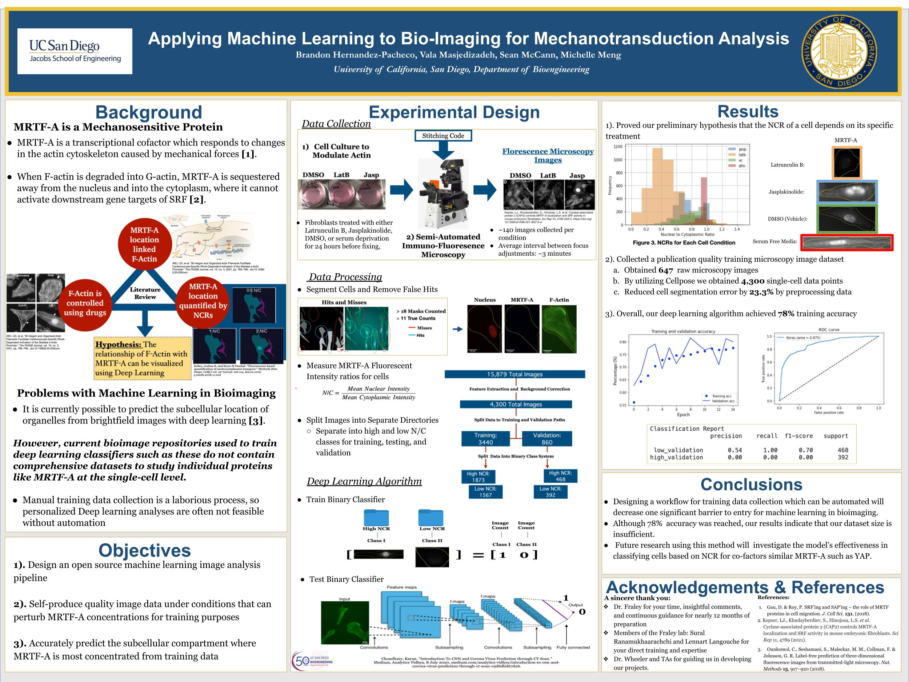

# Group 28: Applying Machine Learning in Bioimaging
__Team Members:__ Sean McCann, Vala Masjedizadeh, Michelle Meng, Brandon Hernandaz-Pacheco\
__Institution:__ University of California, San Diego\
__PI:__ Dr. Stephanie Fraley

Our Image Data is held in this [Google Drive](https://drive.google.com/drive/folders/1PWLIR7QVDr1h6Cpe5ZO-ev7eK3eytPv-?usp=sharing)! 
